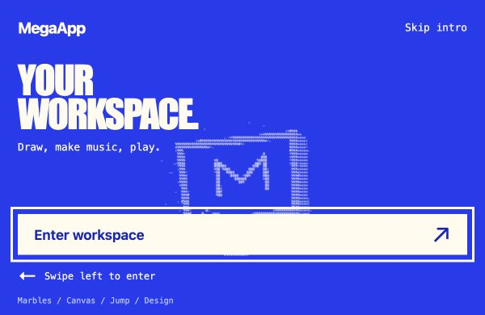
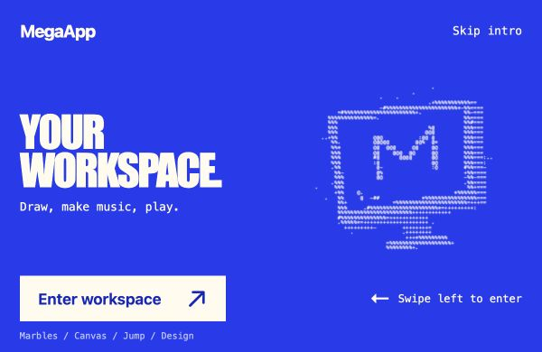

# Design quality pass — October 1, 2026

The pass keeps MegaApp's electric-blue/cream opening, pastel musical board, system typography and existing app dock. It improves the controls and small-screen edges of the current creative environment.

## Prioritized improvements

1. **The intro fits short windows.** At 600 × 390, the original ASCII artwork overlapped the entry button and text. Short landscape windows now use the two-column composition; short narrow windows keep a smaller illustration with clear space around entry. Swipe, replay and reduced-motion behavior remain intact.
2. **Mobile layout stays within the screen.** A real waiting update gets a clear second header row on narrow screens. The State form shrinks correctly at 320px. Marble tools keep Undo and Clear together at that width.
3. **Touch controls have consistent 44px targets.** Buttons, tool segments, pitch selectors, sliders, color input and zoom controls are easier to operate. Native macOS WebKit ignored the pitch selector's original sizing; the closed select now has explicit styling and a visible chevron while retaining native options and keyboard selection.
4. **Keyboard focus is visible and recovers correctly.** Drawing-board outlines sit inside the clipped canvas and use the original blue for contrast in both themes. Leaving a replay through another app route focuses the active dock tab when the previous control is hidden.
5. **Actions and values are clearer.** The install dialog has an accessible name and a direct heading. Theme controls announce the next appearance. The gravity slider can represent the demo's actual value of 480, matching its readout instead of exposing 475.

Runtime files: [styles](../styles.css), [markup](../index.html), [theme action](../src/app.js), [intro focus](../src/intro.js) and [offline shell](../sw.js). No runtime dependency or build step was added.

## Rendered evidence

Actual Chrome on the Mac, before and after at 600 × 390:

| Before | After |
| --- | --- |
|  |  |

- [Final mobile controls](media/design-mobile-controls.jpg), at 390 × 844 in dark appearance.
- [Visible board keyboard focus](media/design-keyboard-focus.jpg), at 1194 × 834.
- [Real update notice and corrected State form](media/design-state-update-320.png), at 320px in Chromium's upgrade fixture.

Chrome also received direct checks of the install dialog, light/dark appearance, nested Design reading, compact State form and smallest header. Temporary browser viewport overrides were reset. An independent screenshot/source critique found no remaining actionable design regression.

## Verification

- `npm run check` and `git diff --check`: passed.
- `npm test`: 36/36 passed. There is no separate repository lint, typecheck or build command.
- Existing general, Marble Music and Pocket Jump browser suites passed in WebKit and Chromium: drawing/input, real keyboard gameplay, repeated pause/restart, cancelled touch, import/export, invalid imports, storage races, audio lifecycle, responsive layouts and offline recovery. General/Marble checks were repeated after the final control/form refinements.
- [Design regression suite](../tests/design-quality-browser.mjs) passed in both engines: seven intro geometries (1194 × 834, 820 × 1180, 390 × 844, 844 × 390, 600 × 390, 390 × 400, 320 × 568), keyboard loop/Escape, cancelled/regrabbed gestures, replay during exit, hidden-focus recovery, reduced motion, dialog Close/Escape, theme labels, 320/390px control layout and invalid-value correction at 320px.
- [Upgrade fixture](../tests/update-browser.mjs) passed Chromium v7 → v8 with a real waiting worker, narrow header/form checks, retained values, HTTP revalidation and offline gameplay. The original v3 → v8 fixture also passed. Its old-version assertion now derives whether Jump existed in that version, rather than assuming it was absent.

The existing supported Playwright runtime was used; nothing was installed. Detailed logs, geometry and additional before/after captures are in the sibling `design-evidence` folder of the isolated checkout's workspace. An initial sandbox browser-launch failure was resolved through authorized local execution. An initial v7 fixture failure was the old assertion described above, not an application regression. A 22px native WebKit selector found by the new tests was repaired and retested.

## Local review and remaining decisions

Work is on `design-quality-2026-10-01`, based on `ec3122c`, in `/Users/mannyfluss/Documents/Codex/2026-09-30/task/MegaApp-design`. The original `/Users/mannyfluss/MegaApp` checkout remained clean on `main` at that base throughout the pass. This is an isolated local clone rather than a worktree because the delegated writable workspace is separate from the project; it preserves all current project history without writing to the user's checkout.

Preview: `http://127.0.0.1:5193/`. Restart with `PORT=5193 npm run dev` from this checkout if needed. Browser data on this test origin stays separate from the public app's origin.

No deployment or remote push occurred during the initial local design pass. The user subsequently requested deployment; the verified release is recorded below. Physical iPad Safari/Chrome, Pencil pressure/hover, OS interruption, Home Screen relaunch and device rotation still need hands-on confirmation. No architecture, authentication, storage migration or new feature was introduced.

## Published release — October 1, 2026

Live at [MegaApp](https://mannyfluss.github.io/MegaApp-pages/). The original clean `main` branch and private remote were fast-forwarded to the design changes, preserving their history. Publication used the existing 23-file website whitelist in the public `MegaApp-pages` repository; development notes, tests, scripts and private history remain excluded.

Live review found a further 320px Marble Music issue: the aspect-ratio board could extend beyond its clipped workspace, and the paired scene/file actions exceeded their grid cells. Follow-up implementation `f989c7e87e8952f1bb60aa992d98ede859fb2eeb` constrains the board to its column and gives scene/file pairs full rows through 420px. Shell v9 delivers that correction through the existing controlled update flow. New regressions cover the whole board, every instrument control, button hit targets and focus without sideways scrolling at 320/390/414px.

Final public runtime commit: `e24ccc9a85b6cf882c9f241837e587c4d9888c5c`. Its [GitHub Pages workflow](https://github.com/MannyFluss/MegaApp-pages/actions/runs/36906877281) completed build, deploy and report steps successfully. All 22 served runtime files returned HTTP 200 and matched the release bytes; `.nojekyll` is the additional hosting marker.

- Repository syntax/asset checks and all 36 unit tests passed after the correction.
- Final design and Marble Music browser suites passed locally and on Pages in Chromium and WebKit. The general and Pocket Jump suites passed on the initial live design release; their implementation was unchanged by the follow-up.
- An existing live v8 client accepted **Update ready**, activated v9, retained its labeled sample and complete Marble scene, and reloaded both toys offline. Keyboard movement/jump/landing and musical playback remained functional. The isolated client was cleaned afterward; existing user profiles were untouched.
- A local real-worker v7 → v9 fixture passed, including waiting-header geometry, retained sample values, HTTP revalidation and offline keyboard gameplay.
- Independent live WebKit review at 320/390/414/820px confirmed full board/control fit and zero sideways scrolling after scene-button focus. WebKit's automated offline fallback used an isolated local origin; the actual Pages offline reload was verified in Chromium.

Deployment logs, runtime hashes, before/after screenshots and upgrade/focus diagnostics are in the workspace's sibling `deployment-evidence` folder. Physical iPad testing remains outstanding.
