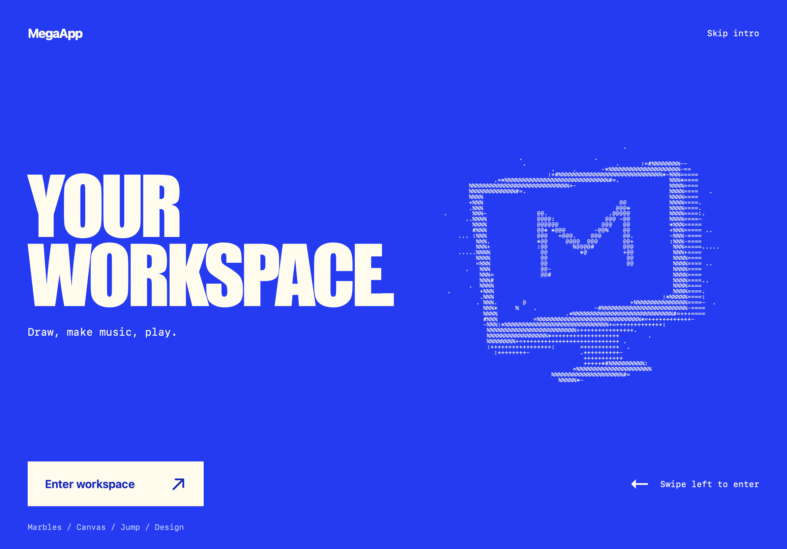

# Workspace intro experiment

A concrete visual specimen for MegaApp's opening, inspired by the electric-blue/cream composition and condensed typography on [Hermes Agent](https://hermes-agent.nousresearch.com/). The ASCII artwork and interaction are original. This experiment is not a completed design guide or a connected Mac terminal.

## Design plan

Color: electric blue `#243bf2`, cream `#fffbed`, deep blue `#1427ba`, and pale blue `#b7c4ff`. Large condensed system type gives the opening its shape; ordinary system monospace labels and procedural ASCII make the computer readable as a tool. No remote assets, typefaces, or AI calls are needed.

```text
MegaApp                                      Skip

YOUR                  [original ASCII computer]
WORKSPACE.            [responds to your pointer]
Draw, make music, play.

[ Enter workspace ]                  Swipe left
Marbles / Canvas / Jump / Design
```

Keep the left-aligned words and one recognizable computer as the opening's two anchors. The swipe physically removes the blue surface to reveal the real workspace underneath. An edge smear and brief settling motion supply weight; input remains available throughout. Keyboard/button entry, reduced motion, and stopping animation when hidden are part of the same interaction.

Review: the subject is a personal creative environment. Preserve the reference's high contrast and condensed type, while replacing its winged figure and sales content with a computer and the tools actually available. Avoid fake connection status, compulsory loading, or generative-AI indicators during this ordinary interface transition.

## Interaction and verification

Open `#intro`, or choose **Design → Try intro**. Swipe left to peel away the opening, tap **Enter workspace**, or use **Skip intro** / Escape for immediate entry. Short pulls return with a small spring; the surface can be grabbed again during its return. Finger, Pencil, and mouse use Pointer Events. The workspace accepts input as soon as entry starts. The ASCII rendering settles after one second and stops; hidden pages cancel rendering, and reduced motion removes the transition. No audio starts from the opening.

The opening appears once per browser session on a fresh un-hashed visit; app deep links bypass it. This acknowledgement is a tiny optional sessionStorage flag, not configuration or project state. The intro module joins offline shell v7.

Automated Chromium and WebKit checks passed for focus and keyboard actions, button entry, short/interrupted/regrabbed gestures, replay, direct game links, reduced motion, and four viewport sizes: 1194 × 834, 820 × 1180, 390 × 844, and 844 × 390. Both engines loaded the intro from the prepared offline shell and entered a playable Marble Music workspace. Cancelled touch events were checked in both; Chromium also completed a swipe using its native touch emulator. The visibility handler was checked using an explicit visibility signal. These are browser automation results, not physical iPad/Pencil or OS backgrounding verification.

The existing WebKit playground suite passed drawing, storage, imports/exports, capability probes, mobile layout, and offline recovery. Chromium's real HTTP-cache upgrade fixture passed v3 → v7 with state retained and playable offline Pocket Jump. Unit tests: 36 passed. `npm run check` passed.

The WebKit Marble Music suite also passed editing, touch/pen/mouse input, audio lifecycle, saving, import/export, three layouts, and stopped-origin offline recovery.

## Published result

Live at [MegaApp / intro](https://mannyfluss.github.io/MegaApp-pages/#intro). GitHub Pages confirmed public runtime commit `d82671430e11f019342a392b6160c8c26d64a17a` built successfully from private implementation `12ce009`. The public file whitelist and runtime bytes were checked before publishing; project notes and history remain private. Both browser engines passed the full intro smoke checks against the actual Pages URL, and Chromium passed a prepared offline reload followed by entry and Marble Music playback there.

An existing installation may first show **Update ready**. Apply it, then reopen the intro link. Replay is also available in **Design → Try intro**.


