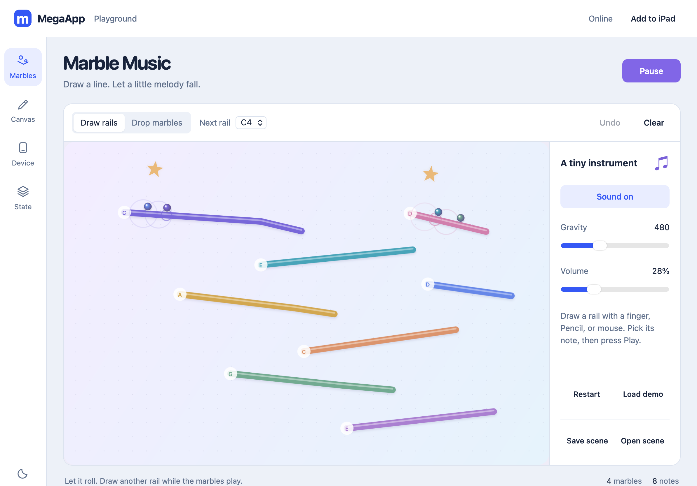

# Marble Music morning handoff

Complete and verified on September 30, 2026, around 1:19 AM Pacific, ahead of the 8 AM target. The promised creative toy is ready; further overnight implementation is unnecessary.

## Try it

**[Open the live app on your iPad](https://mannyfluss.github.io/MegaApp-pages/)** in Safari or Chrome. It is published on GitHub Pages with HTTPS.

The development preview is at **http://127.0.0.1:5186/** on the Mac. If it stops, run `PORT=5186 npm run dev` from the project directory.

The app opens to **Marbles** with a colorful starter instrument. Press **Play** to release the melody and enable sound. Choose **Draw rails** and a **Next rail** pitch to sketch with finger, Pencil, or mouse; choose **Drop marbles** to tap in another ball. Pressure is optional. **Gravity** changes the pace; **Volume** and **Sound on/off** control audio. **Undo**, **Clear**, **Restart**, and **Load demo** make experimentation reversible. **Save scene/Open scene** transfer JSON.

[Short interaction recording](media/marble-demo.webm): playback, drawing a rail, dropping a marble, and pausing. The recording is silent; the live toy synthesizes notes.

## Delivered

- [Toy controller](../src/marble.js): canvas rendering, Pointer Events, editing, synthesized pentatonic audio, and save/recovery lifecycle.
- [Physics and validation](../src/marble-physics.js): circle/segment collisions with endpoints, bounded substeps/speed/particle count, contact sound debouncing, and strict scene limits.
- [App integration](../src/app.js), [interface](../index.html), and [styles](../styles.css): Marbles as the initial app, responsive board and controls, existing Canvas/Device/State labs retained.
- [Offline shell](../sw.js): both new modules included in version `megaapp-shell-v3`. No external runtime dependency, backend, fonts, or service is required.

The large pastel board, rounded colored rails, glossy marbles, and brief collision rings make a small physical instrument. Controls use the environment's existing system typography. The 960 × 640 logical scene retains geometry across sizes.

Tracks, launch positions, gravity, and volume persist in the sample namespace `apps.marble.scene`. State edits/imports validate and update the open instrument; pending saves cannot overwrite imported scenes. Removal/reset restores the demo without recreating the saved row until another edit. This remains prototype data, not a production environment schema. Moving balls and voices are temporary; reload returns paused. Hidden/off-tab playback and sound stop and require explicit Play to resume.

## Verification

- `npm run check`: passed JavaScript syntax, manifest, HTML assets, and offline assets.
- `npm test`: **20 passed**, including 11 new physics/validation tests for fast collisions, rail endpoints/thickness, slopes, resting contacts, frame gaps, scene limits, and sustained bounded spawning.
- [Marble browser suite](../tests/marble-browser.mjs): passed in Playwright **WebKit and Chromium**. Covers demo collisions/audio, mouse/touch/pen coordinates, editing/undo/reset, JSON import/export, reload recovery, shared State mutation races, muted-start volume activation, and stopping on leaving the toy.
- [Existing lab suite](../tests/browser.mjs): passed in both engines, including drawing, gestures, typed values, concurrent writes, safe imports, capability probes, storage fallback recovery, and offline reload.
- Landscape 1194 × 834, portrait 820 × 1180, and narrow 390 × 844 screenshots inspected; no horizontal overflow. Offline reload/play verified from the prepared service-worker shell, with an uncached control that fails offline. WebKit uses an isolated stopped server; Chromium uses offline emulation.
- Final independent code review found no remaining actionable blocker.

## Deployment and device checks

The user approved a separate public website repository on September 30, 2026. [MannyFluss/MegaApp-pages](https://github.com/MannyFluss/MegaApp-pages) contains the runtime website files and `.nojekyll`, with one fresh deployment commit `5b24ea2` based on private implementation `57de707`. GitHub Pages reports the build successful, and the HTTPS URL returns the expected app. The development [MannyFluss/MegaApp repository](https://github.com/MannyFluss/MegaApp), its notes/tests/scripts, and original history remain private. No purchase or backend was added. Local browser values were not copied into the public repository.

Live HTTPS checks passed in WebKit and Chromium: demo playback/collision notes, audio activation only after Play, drawn rails and gravity recovery after reload, and no failed asset/module requests or page errors. The service worker has `/MegaApp-pages/` scope with all 18 shell assets cached. Chromium offline reload came from the service worker and preserved/playable scene state. The live WebKit screenshot was visually inspected. These are automated engine checks, with the device limits below.

Automated WebKit and Chromium do not establish success on a physical iPad or Pencil. Next hands-on checks are real Safari/Chrome input, rotation/split view, audible sound and interruption recovery, Home Screen installation/storage, and airplane-mode relaunch. Browser storage is evictable; export scenes worth keeping.

The overnight automation is paused. Resume work for user feedback, actual device results, or a requested feature; do not expand the toy simply because another scheduled wake-up occurs.
