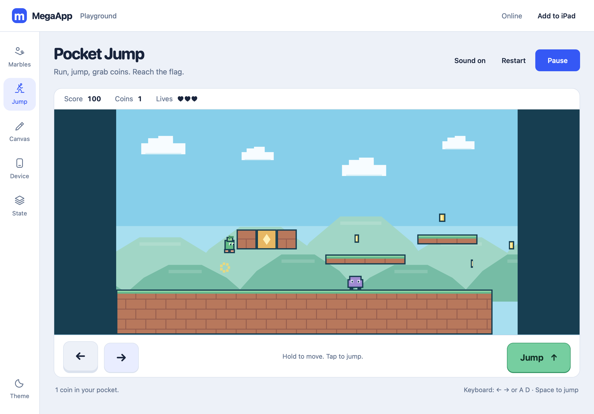

# Pocket Jump

A small original side-scrolling platformer inside MegaApp. Run, jump, collect coins, hit bonus blocks, stomp blobs, and reach the finish flag. One level, three lives, and a halfway checkpoint keep the first version simple and playable.

## Design plan

Palette: sky blue `#87cfea`, deep teal ink `#173e51`, leaf green `#55b884`, copper ground `#be704d`, coin yellow `#ffd15c`, and blob purple `#8666ba`. The hero is a little green sprout with peach boots. All art is drawn locally; there are no external sprites, fonts, or assets.

Type: the environment's system family for controls and instructions, rounded system type for the title, and tabular numerals for score/lives. Keep the title and instructions left aligned; center the world and its start/pause overlay.

Layout:

```text
App dock | Pocket Jump                 Sound / Restart / Start
         | Score / Coins / Lives
         | [                game world                    ]
         | [ left ][ right ]                   [ Jump ]
         | Short status and keyboard instructions
```

The game world is the memorable element. Large thumb controls remain outside the action so fingers do not hide obstacles. Landscape and portrait use the same logical world; the camera follows the player. Playback begins deliberately and pauses when the app loses attention.

Review against the brief: this is a basic playable game, so omit level selection, character customization, a marketing screen, and a separate account/progress system. Color and simple pixel shapes carry the playful character. The existing environment supplies navigation and quiet controls.

## Implementation and verification

The game is implemented in [platformer-engine.js](../src/platformer-engine.js) and [platformer.js](../src/platformer.js), integrated through the **Jump** dock tab and `#jump` route. The engine uses bounded 120 Hz substeps, jump buffering, a short grace period after leaving an edge, and variable jump height, including taps that begin and end within one frame. The renderer and input controller pause, clear held controls, and suspend sound when hidden or outside the game.

The level has 20 placed coins, four bonus blocks, four patrolling blobs, four gaps, a midpoint checkpoint, and a finish flag. Keyboard controls are arrows or A/D for movement and Space/↑/W for jumping. iPad controls support simultaneous fingers on movement and Jump. Restart begins a fresh game; progress remains temporary.

Verification before publishing:

- `npm run check` passes, and all **36 unit tests** pass. Sixteen platformer tests cover solid collision/undersides, variable jump height, quick taps, buffered jumps, gaps, coins/blocks, stomps, life loss, checkpoint respawn, game over, win, and finite motion. A complete level route wins through movement and jumps without modifying player state.
- [Platformer browser suite](../tests/platformer-browser.mjs) passes in WebKit and Chromium: actual keyboard play to the flag, coins/stomps/scoring, collision and restart, sound, touch pointer holds/cancellation, pause/resume lifecycle, and offline gameplay.
- Landscape 1194 × 834, portrait 820 × 1180, and narrow 390 × 844 screenshots were checked. Thumb controls remain separate from the world, and navigation fits without horizontal overflow.
- Existing Canvas/Device/State and Marble Music browser suites pass in both engines, including persistence and offline recovery.
- Service-worker shell version `megaapp-shell-v5` includes both game modules. Navigation fragments are normalized before matching cached assets, so app links such as `#jump` and `#state` also reload offline. WebKit offline verification stops an isolated server; Chromium uses offline emulation.

The first live upgrade exposed a browser HTTP-cache bug: a new worker could precache the previous app's still-fresh HTML and JavaScript, leaving the new game uninitialized. A real-server [update regression](../tests/update-browser.mjs) reproduces the old-to-new install with 600-second cache headers and ETags, without request interception. New shells now fetch fresh files during installation; online asset requests revalidate, while failed network requests recover from the prepared shell cache. The test checks the updated game, retained sample state, offline play, and a later asset change while the HTTP cache is still fresh.

The update regression passes in WebKit and Chromium. On the actual GitHub Pages origin, a browser loaded before the v5 release accepted **Update ready**, retained its saved sample value, played Pocket Jump, and reloaded the `#jump` route offline. The published runtime commit is `feb8497`; HTTPS serves the v5 shell. Fresh-client game checks also pass on the public URL.



Publishing uses the existing public website-only [MegaApp-pages repository](https://github.com/MannyFluss/MegaApp-pages); the development repository stays private. Physical iPad/Pencil testing is not established by automated desktop WebKit/Chromium runs.
